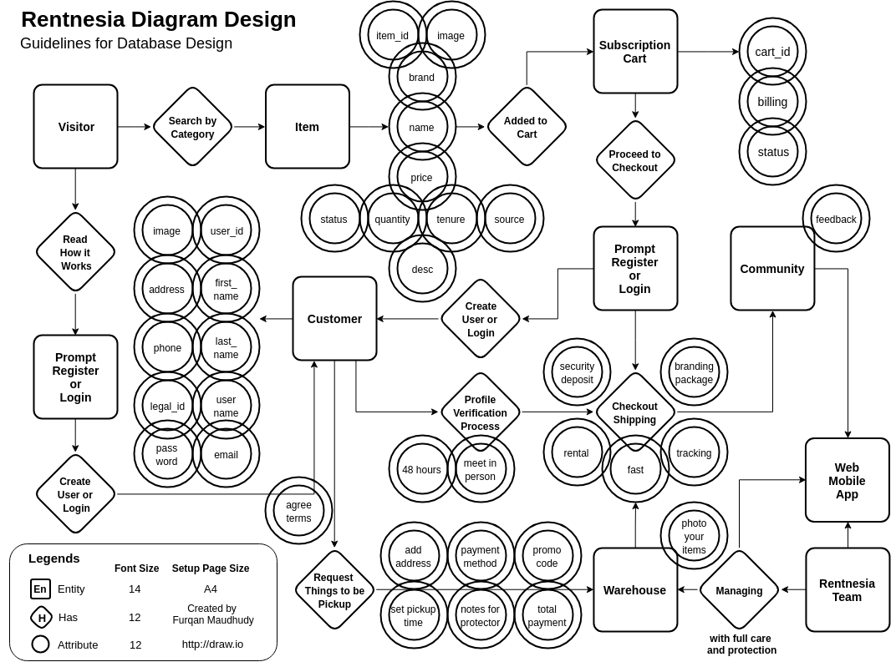
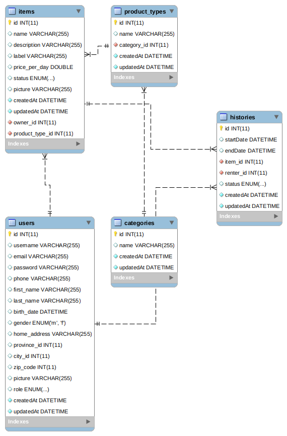

# Rentnesia Backend, API & Data Specification

Rentnesia, a web app that can make users store, borrow and rent things online in your neighborhood

## Tech Stack

-   [**Nodejs**](http://nodejs.org/) Server Runtime Environment
-   [**Expressjs**](http://expressjs.com/) Node.js Framework
-   [**Sequalizejs**](http://docs.sequelizejs.com/) ORM That Talks to Database
-   [**MySQL**](http://mysql.com/) SQL Database Management System
-   [**AWS**](http://aws.amazon.com/) Amazon Web Services
-   [**Heroku**](http://heroku.com/) Backend Deployment System
-   [**JWT**](http://jwt.io/) Securely Transmitting Information
-   [**bcrypt**](http://github.com/kelektiv/node.bcrypt.js) Password Hashing Function

## Preparation

### Diagram Design

### Database Design

### Database Management System

Install `mysql` database management system

## Installation and Configuration

1.  Run: `npm install` or `yarn install` to install the dependencies
2.  Create database
3.  Edit .env
4.  Run: `npm migrate` or `yarn migrate` to create the tables into the database

## Running

### Development

Run: `npm run dev` or `yarn dev` to run server

### API Testing

Install: `POSTMAN` or `INSOMNIA` to test API

### Production

Run: `npm run start` or `yarn start` to run server

## API Endpoints Version 1

Run with: `/api/v1/` 
Root URL: `http://localhost:8000`
For Example: `http://localhost:8000/api/v1/users` 

### Authentication

| Endpoint           | HTTP | Description          | Body                               |
| ------------------ | ---- | -------------------- | ---------------------------------- |
| `/auth/login`      | POST | Sign in users        | `username or email, password`      |
| `/auth/signup`     | POST | Sign up users        | `username, email, password, role`  |
| `/auth/verify`     | GET  | Verify users         | `token`                            |

### Items

| Endpoint           | HTTP | Description                 |
| ------------------ | ---- | --------------------------- |
| `/items`           | POST | Create a new item           |
| `/items`           | GET  | Get all items               |
| `/items/:id`       | GET  | Get item by id              |
| `/items/search?q=` | GET  | Search item data by keyword |
| `/items/:id`       | PUT  | Update item by id           |
| `/items/:id`       | DEL  | Delete item by id           |

### Users

| Endpoint                 | HTTP   | Description                 |
| ------------------------ | ------ | --------------------------- |
| `/users/`                | GET    | Get all users               |
| `/users/:id`             | GET    | Get one user by id          |
| `/users/:id`             | PUT    | Update user profile         |
| `/users/:id`             | DELETE | Delete user profile by id   |

## License

[MIT License](./LICENSE)
